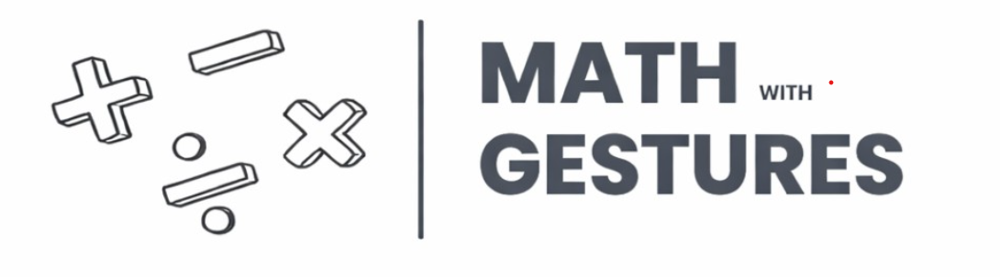

# mathgesture-
# ✨ Math with Gestures



## 📌 Overview

Math with Gestures is an AI-powered application that allows users to solve mathematical problems using hand gestures instead of a keyboard or mouse.

The system uses Computer Vision, Hand Tracking, and Google Gemini AI to recognize mathematical expressions drawn in the air and instantly generate solutions.

---

## 🚀 Features

- ✋ Real-time hand gesture detection
- 🧠 AI-powered math solving
- 🎥 Live webcam integration
- 🖌️ Virtual drawing canvas
- ⚡ Instant result generation
- 🧹 Gesture-based canvas clearing
- 💻 Interactive Streamlit UI

---

## 🛠️ Technologies Used

- Python
- OpenCV
- cvzone
- NumPy
- PIL (Python Imaging Library)
- Streamlit
- Google Gemini API

---

## 📂 Project Structure

```bash
Math-with-Gestures/
│── main.py
│── mathGestures.png
│── requirements.txt
│── README.md
```

---

## ⚙️ Installation

### 1️⃣ Clone the Repository

```bash
git clone https://github.com/your-username/math-with-gestures.git
cd math-with-gestures
```

### 2️⃣ Install Dependencies

```bash
pip install -r requirements.txt
```

### 3️⃣ Add Gemini API Key

Replace this line in `main.py`:

```python
client = genai.Client(api_key="YOUR_API_KEY")
```

---

## ▶️ Run the Project

```bash
streamlit run main.py
```

---

## ✋ Gesture Controls

| Gesture | Action |
|----------|--------|
| ☝️ Index Finger Up | Draw on Canvas |
| ✋ All Fingers Up | Clear Canvas |
| 🤟 Custom Gesture | Send to AI |

---

## 🔄 Workflow

1. Webcam captures hand movements  
2. Hand tracking detects finger positions  
3. User writes math expressions in air  
4. Virtual canvas stores drawing  
5. Image is sent to Gemini AI  
6. AI solves the problem  
7. Result is displayed instantly  

---

## ⚠️ Limitations

- Requires proper lighting
- Internet required for AI processing
- Complex handwriting may reduce accuracy
- Camera quality affects performance

---

## 📈 Future Scope

- Advanced equation recognition
- Mobile application support
- Offline AI integration
- Voice + gesture control
- Graph and matrix solving

---

## 👨‍💻 Author

**Chayan Chauhan**
